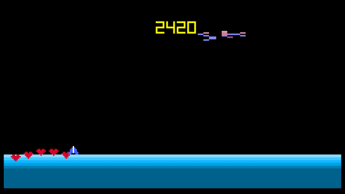

# rusty_demon_attack
A game inspired by the classic atari game: demon attack

You can play the game in the web!
https://tantandev.itch.io/rusty-demons-attack



Written using Rust and a game framework called macroquad: https://github.com/not-fl3/macroquad

I documented the creation of this game on my Youtube channel: https://youtu.be/Ymq35SIv9Gg

# Building to WebAssembly
Add build target for webassembly
```bash
rustup target add wasm32-unknown-unknown
```
There is a script in utils/wasm/build.sh.
```bash
./build.sh
```
This script compiles the program with cargo, takes the generated rusty_demon_attack.wasm file, and the files in utils/wasm/ and
moves them into a new folder called static/.
To run it in the browser I'm, using [basic-http-server](https://crates.io/crates/basic-http-server).
```bash
cargo install basic-http-server
```
start the server by using the correct path
```bash
basic-http-server . # starts server based on current directory
basic-http-server static # start server in the folder /static
```


### External assets with license
in this project I'm using Kenny assets fonts which is using:
License: (Creative Commons Zero, CC0)
